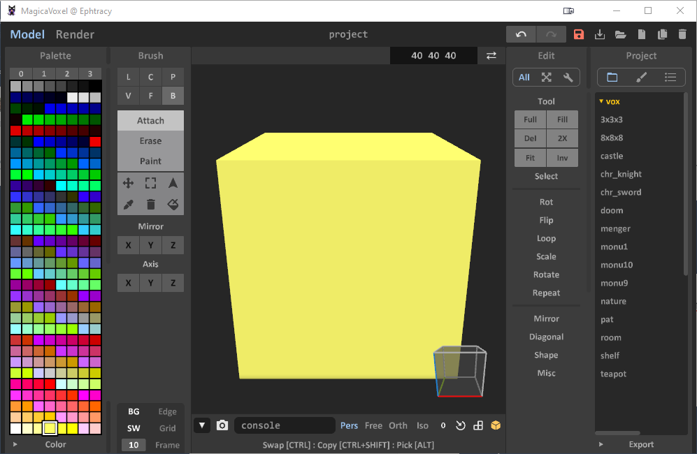

# Shader Reference

## Introduction

In MagicaVoxel, a shader is a fragment of code used to generate shapes and colors in your project.

You can execute a shader by typing the `xs` command in the console:

```text
xs [option] [shader-name] [arg0] ... [arg7]
```

The shader-name parameter will be based on the shader itself. You can add up to 8 parameters \(`arg0` to `arg8`\), if the shader expects them.

Available options are:

* `-n`: followed by a number, it will iterate the shader a number of times


For an introductory tutorial, please check the [Writing Your First Shader](../tutorials/writing-your-first-shader.md) tutorial.


## Built-in

A shader comes with a number of built-in functions and inputs.

### Inputs

These are the available inputs you can use in your shader:

* `uniform vec3 iVolumeSize`: the voxel volume \(i.e.: the object you are editing\) dimensions
* `uniform float iColorIndex`:
* `uniform vec3 iMirror`:
* `uniform vec3 iAxis`:
* `uniform float iFrame`: ?
* `uniform float iNumFrames`: ? 
* `uniform float iIter`: the current iteration index
* `uniform vec4 iRand`: a random number
* `uniform float iArgs[8]`: an array of user parameters. Use it to pass any custom data you may need

### Functions

These are the available functions you can use in your shader:

* `float voxel(vec3 v)`: returns the voxel color index at position `v`. If no voxel is present, it will return 0

### The map\(\) Function

Each shader should have a `map()` function with this syntax:

```text
float map(vec3 v) {
  // your code here
}
```

This method will generate a new voxel \(of a defined color index\) al position `v`.

#### Example

The following code will fill the full space of your voxel model wil voxels of color index 4:

```text
float map(vec3 v) {
	return 4;
}
```



